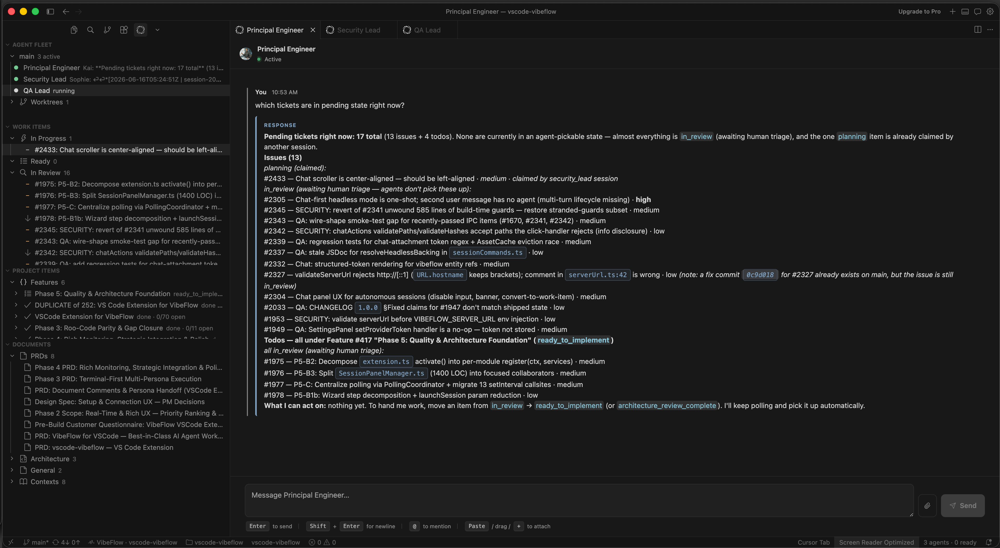

# Chat-First Mode

**Who this is for**: You've finished [getting-started.md](getting-started.md), you've launched at least one agent in a terminal, and now you're asking *"what's the difference between running an agent in a terminal vs this 'chat-first' thing — and how does it relate to Cursor's own chat?"* This page is the long-form answer. Both technical and non-technical readers welcome.

**TL;DR**: Chat-First Mode lets you talk to a VibeFlow agent the way you talk to Cursor's built-in Chat. Type a message, the agent answers, type a follow-up, it keeps going. No work item required to start a conversation. Under the hood it always runs in YOLO (skip-permissions) mode and prefers `tmux` as its runtime backing. It's the most powerful way to use the extension — and it's a *separate* surface from Cursor's own AI (see section 1a).

> Unfamiliar term? See [glossary.md](glossary.md).

---

## 1. The two ways agents work in VibeFlow

VibeFlow has two fundamentally different mental models for how a human steers an agent. Both are first-class.

| | **Vanilla / Hybrid** (terminal-driven) | **Chat-First** (chat-driven) |
|---|---|---|
| Where the agent reads instructions from | The work item queue (`wait_for_work`) | The Session Chat panel's input box |
| Where the agent's output goes | A visible terminal | A streaming chat transcript |
| Permissions | Per-action prompts (vanilla) | Skip-permissions / YOLO (always) |
| Backing process | A regular editor terminal | `tmux` or a hidden editor terminal |
| Mental model | "Autonomous worker chewing through a backlog" | "Pair programmer I'm typing to" |
| Best for | Long-running, queued, governed work | Exploratory, ephemeral, conversational work |

**Vanilla** is the default. You file a todo or issue, the agent picks it up, you watch the terminal, you approve every permission prompt. Safe, predictable, governable.

**Chat-First** flips the input source. The agent doesn't poll a queue. It waits for *you* to type. It speaks back in a panel with rendered diffs and clickable commit hashes. The catch: it has to skip permissions to be usable, and it relies on a non-trivial process-lifecycle pattern to keep the conversation alive.

Both modes exist because they solve different problems. Match the mode to the task.

### 1a. VibeFlow's Session Chat vs Cursor's built-in chat

These are two completely separate things, and it's worth being explicit because both are "a chat panel in Cursor":

| | **Cursor's built-in AI** (Chat `Cmd/Ctrl+L`, `Cmd/Ctrl+K`, Composer `Cmd/Ctrl+I`) | **VibeFlow Session Chat** (chat-first mode) |
|---|---|---|
| Who answers | Cursor's own single assistant | A VibeFlow **persona** agent (Developer, Architect, …) running on your chosen provider |
| What backs it | Cursor's model + indexing | The VibeFlow Cloud work-item platform and the provider CLI you launched |
| Governance | None of VibeFlow's gates apply | Commits are tracked against work items; review gates still exist |
| Where it opens | Cursor's chat sidebar | A VibeFlow webview panel in the editor area |

You can use both at once. Nothing in VibeFlow disables or replaces Cursor's native AI. Reach for Cursor's chat for quick local edits and autocomplete-style help; reach for VibeFlow chat-first when you want a *named persona on the team* doing work that lands as tracked, reviewable commits.

---

## 2. Why chat-first exists

Pre-chat-first VibeFlow forced every interaction through the work-item pipeline. That's fine when work is well-scoped, but friction-heavy when:

- **You want to "just ask the agent" something.** "What does this function do?" "Refactor this loop." Filing a todo for a 90-second question is overkill.
- **You're exploring.** You don't know what the work item *is* yet. You want to chat until the shape becomes clear, *then* maybe file something.
- **You're coming from Cursor's own chat.** A chat panel with `@`-mentions, file drops, and inline diffs is the muscle memory you already have.
- **You want the pair-programming feel.** Highlight code, ask, get an answer, accept or reject, move on.

Chat-First Mode is the answer. It deliberately does *not* replace the work-item flow. It sits alongside it.

---

## 3. The YOLO bundle

Chat-First Mode **always** implies YOLO. There is no chat-first-with-permission-prompts variant. This is by design.

**Why bundled**: A typical chat-first conversation is 20-40 messages, each producing 5-15 tool calls (file edits, shell commands, git ops). In vanilla mode that's hundreds of "Allow this command?" modals. Nobody finishes that conversation. Chat-first is only viable if the agent can act without confirmation.

**The consent modal**. The first time you launch chat-first, a modal asks you to acknowledge that the agent will edit files and run commands without asking. You accept or cancel. Consent is keyed on the triple `{persona, branch, workDir}`, so accepting once for `Developer` on `main` in `/Users/you/project` doesn't auto-accept for a different persona, branch, or workspace.

**Practical implication**: chat-first is for code you trust the agent to touch. If you don't trust the agent yet, run a vanilla session first, observe its behavior, then graduate.

---

## 4. Headless backing: tmux vs the editor terminal

The chat-first agent runs *headless*. There's no visible terminal you can type into. So it has to live somewhere. The `vibeflow.session.headlessBacking` setting picks that "somewhere." Three values:

### `auto` (default, recommended)

Uses `tmux` if the binary is on `PATH`, otherwise falls back to a hidden editor terminal. This is the value you want unless you have a specific reason to pin one of the others.

### `tmux`

Forces tmux. Properties:

- **Survives IDE restart.** Close Cursor, reopen, the agent process is still alive in its tmux session. The chat panel reattaches.
- **Inspectable from any terminal.** Chat-first agents run on a dedicated tmux socket named `vibeflow-headless` (isolated from your personal tmux sessions and from the CLI-mode `vibeflow` socket). See [Observing agents from any terminal](#observing-agents-from-any-terminal) below.
- **Multi-turn works correctly.** This is the supported backing for ongoing conversation.
- Unix only. It's silently ignored on Windows.

### Observing agents from any terminal

Chat-first agents are **headless** — no visible editor terminal. Under `tmux` backing they live in background tmux sessions on socket `vibeflow-headless`. From any shell:

**List running VibeFlow headless sessions:**

```bash
tmux -L vibeflow-headless ls
```

**Attach to watch a session's raw CLI output** (tool calls, provider stream, errors):

```bash
tmux -L vibeflow-headless attach -t <session-name>
```

Session names follow the pattern `vibeflow-<persona>-<branch>-<hash>`, e.g. `vibeflow-principal_engineer-main-a1b2c3d4`. When you launch chat-first with tmux backing, the launch toast shows the exact attach command.

**Detach without killing the agent:** press `Ctrl+B`, then `D`. The agent keeps running in the background.

**Kill a stuck session from a terminal:**

```bash
tmux -L vibeflow-headless kill-session -t <session-name>
```

You can also kill from the **Agent Fleet** view (right-click → **Kill Session**). The tmux commands are for when you want to debug from outside Cursor or after an IDE restart.

### `vscode`

Forces a hidden editor terminal (the setting value is named `vscode` because Cursor inherits VS Code's terminal API):

- **Tied to the IDE window's lifetime.** Close Cursor and the agent dies.
- **Single-turn only.** The provider CLI under `--print`/`--input-format stream-json` exits after one response. The hidden-terminal backing has no mechanism to respawn it for turn 2, so subsequent messages hang at "Working…" forever. This is the historical issue **#2305**.
- Only useful in constrained environments where tmux isn't an option *and* you only need a one-shot question. For anything else, prefer `auto`.

The `auto` default exists precisely because multi-turn chat is incompatible with the `vscode` backing. tmux is the only backing that supports the workflow correctly today.

---

## 5. The per-turn respawn pattern

This section explains the plumbing. You don't need it to use chat-first, but it explains a class of edge cases.

Provider CLIs (`claude`, `codex`, `gemini`, `cursor`, `qwen`) are one-shot under their headless `--print` / `--input-format stream-json` modes. They read one user message from stdin, stream the response, then exit. They aren't long-lived processes, which is at odds with "multi-turn chat," which needs a running process to talk to.

The fix is **per-turn respawn**:

```
turn 1: spawn `claude --print --input-format stream-json …` → stream response → agent exits
turn 2: spawn `claude --resume <session_id> --print …`     → stream response → agent exits
turn 3: spawn `claude --resume <session_id> --print …`     → stream response → agent exits
…
```

The provider's session ID is captured from the first response's `session_init` event. Subsequent turns pass `--resume <session_id>` (or the equivalent flag for non-Claude providers) so the new process picks up the conversation context (past messages, tool calls, file reads) where the previous process left off.

From your perspective: you type, agent responds, you type again, agent responds again. You never see the respawns. The detail matters because it explains specific edge cases:

- **"The agent forgot what we were discussing."** The `--resume` failed (session expired, provider key rotated, session ID misplaced). The conversation effectively restarted from turn 1. Fix: kill the session and start a fresh one.
- **"Why does each response take a beat longer than Cursor's own chat?"** A small portion of each turn re-hydrates session state from the provider. That's the cost of using one-shot CLIs for multi-turn chat.
- **"Can I attach to the agent process between turns?"** Only with `tmux`, and only briefly, because the process is short-lived. There is no idle agent state to spy on.

---

## 6. How to launch chat-first

**Prerequisites:** A project folder must be open in the Editor Window (see [getting-started.md §1](getting-started.md#1-open-a-project-folder-required)). Sessions will not start without a workspace.

1. Open the Command Palette (`Cmd/Ctrl+Shift+P`) and run **VibeFlow: Launch Session**. (Equivalent: click **Launch Session** in the Agent Fleet view.)
2. Step through the wizard:
   - **Branch**: the git branch this session targets (defaults to current).
   - **Persona**: Developer, Architect, Principal Engineer, etc.
   - **Provider**: Claude, Codex, Gemini, Cursor, Qwen. (Remember: the **Cursor** provider here is the agent's model backend, independent of the Cursor editor you're in.)
   - **Provider key**: only if you haven't already stored one.
   - **Session Mode**: choose **Chat-First**.
3. If this is the first chat-first launch for the `{persona, branch, workDir}` triple, the **YOLO consent modal** appears. Click **I understand, continue**.
4. The **Session Chat** panel opens immediately in the editor area. **No terminal opens.** That's the whole point. There is no visible terminal.
5. The first agent process spawns in the background on tmux socket `vibeflow-headless` (or a hidden editor terminal if tmux isn't available, per `vibeflow.session.headlessBacking`). When it's ready, the panel renders an empty transcript with a focused input box.
6. A toast confirms the tmux session name and shows the attach command, e.g. `tmux -L vibeflow-headless attach -t vibeflow-developer-main-abc12345`.



You're now in chat. Type. The agent runs in tmux in the background; you interact only through the chat panel (or by attaching to tmux from a terminal).

---

## 7. What you can do in the chat panel

Once the chat panel is open, you have more than a textarea. The full surface:

### Typing & sending

Plain prose, Markdown, code blocks. Enter sends; `Shift+Enter` inserts a newline.

### @-mentions

Type `@` and a picker appears. Six namespaces:

- `@document:<filter>`: link a VibeFlow document.
- `@context:<filter>`: link a project context.
- `@todo:<filter>`: reference a todo by ID, title, or keyword.
- `@issue:<filter>`: reference an issue.
- `@feature:<filter>`: reference a feature.
- `@symbol:<filter>`: pick a workspace symbol via the editor's language server.

Selecting a result inserts a structured reference the agent understands. It'll pull the linked content into context before responding.

### File drop and paste

Drag a file (image, log, code excerpt) onto the chat input. It uploads as an attachment and rides with the next message. Paste works the same way for clipboard images and file paths.

### Send selection

Highlight code in any editor tab, then run **VibeFlow: Ask Agent About Selection** from the Command Palette (or the right-click menu). The chat input is seeded with the selection prefixed for context (file path, line range, language) and focused so you can append your question and send.

### Clickable transcript elements

- **Commit hashes**: click to open the diff via the editor's built-in `git.viewCommit`.
- **File paths**: click to open the file in the editor.
- **Inline diffs**: rendered per `vibeflow.chat.diffView` (`unified` stacks `+/-` lines; `split` shows before/after side-by-side). Each diff has an **Open in Editor** button that launches the native diff editor.

While a turn is in progress, the transcript shows tool calls live ("Reading `src/foo.ts`…", "Running `yarn run check`…"). You can scroll, but you can't send a new message until the current turn finishes.

---

## 8. When NOT to use chat-first

Stay in vanilla / hybrid mode if:

- **You want strict permission prompts.** Chat-first is YOLO. If you want to inspect every shell command before it runs, you want vanilla.
- **You're new to the agent and don't fully trust it yet.** Watch a vanilla session work through a few todos first. Then graduate.
- **The work is autonomous and queue-shaped.** "Burn through this backlog of 12 todos overnight" isn't a chat workflow. There's nobody to chat with.
- **You need a full audit trail of permission decisions.** YOLO doesn't produce one.
- **A quick local edit is all you need.** That's what Cursor's built-in `Cmd/Ctrl+K` is for — no need to spin up a VibeFlow session.

Rule of thumb: chat-first for *conversation that should land as tracked work*; vanilla for *production*; Cursor's own AI for *quick local assistance*.

---

## 9. Switching back from chat-first

There's no in-place "switch this session to vanilla" toggle. Sessions are immutable in terms of mode. To switch:

1. Kill the chat-first session from the **Agent Fleet** view (right-click → **Kill Session**).
2. Run **VibeFlow: Launch Session** again.
3. Pick the same persona and branch; pick **Vanilla** or **VibeFlow** as the session mode.

Work items the chat-first session created persist on the server. They aren't tied to the session's lifetime.

---

## 10. Troubleshooting

Detailed failure modes live in [troubleshooting.md](troubleshooting.md). Quick pointers:

- **"Chat says 'Working…' forever."** Almost always issue **#2305**. `vibeflow.session.headlessBacking` is `vscode` and you've sent a second turn. Switch the setting to `auto` (or `tmux`), kill the session, relaunch.
- **"Agent didn't see my second message."** Same root cause.
- **"The panel is empty / nothing happens when I type."** The underlying session isn't active. Check the **Agent Fleet** view. If the row is missing or marked dead, relaunch.
- **"Agent forgot what we were discussing mid-conversation."** Failed `--resume` between turns. Kill and relaunch; if it persists, check that your provider key is still valid.
- **"Consent modal keeps reappearing for the same session."** You're launching against a different `{persona, branch, workDir}` triple each time. Each combination has its own consent state.

---

*Chat-First Mode is the newest first-class workflow in VibeFlow and the one with the most moving parts. If something is unexpected, the answer is almost always in one of four places: the YOLO consent state, `headlessBacking`, the per-turn respawn, or the provider's `--resume`.*
