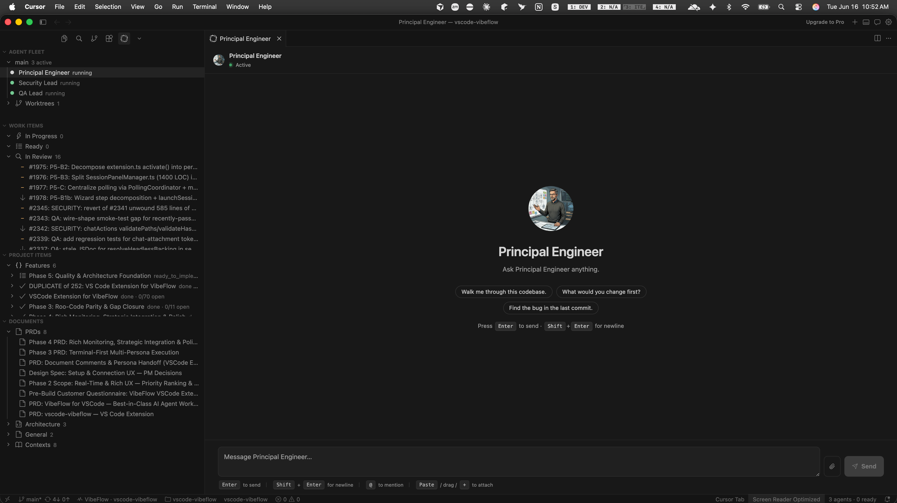
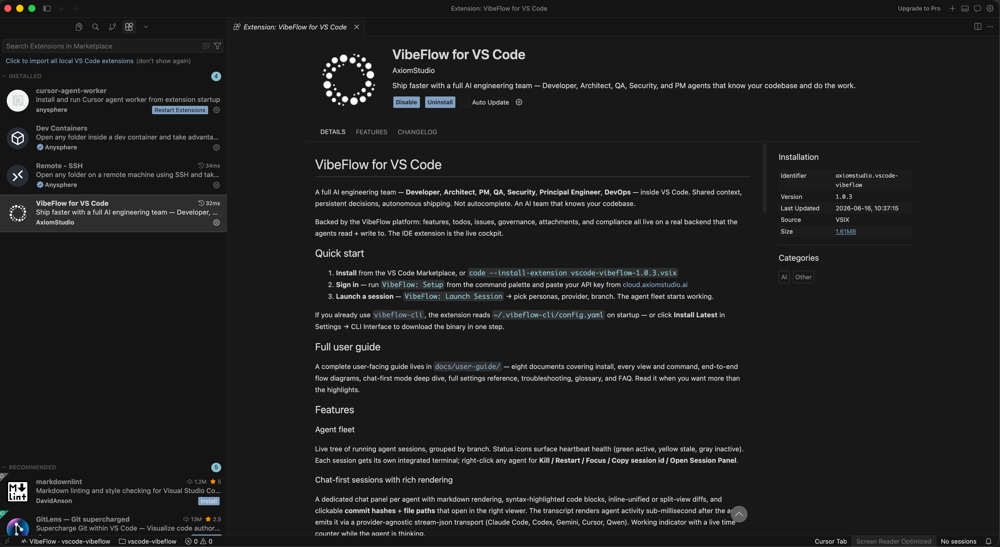

# Getting Started with VibeFlow in Cursor

**Who this is for**: You just installed the VibeFlow extension in Cursor, you've never used it before, and you want a calm, opinionated walkthrough that gets you from zero to "an agent did a thing for me" in about ten minutes. Cursor basics assumed; nothing else.

**TL;DR**: **Open a project folder first** (sessions won't start without one). Switch to the **Editor Window** if you're in Cursor's Agents Window — that's where extensions and the VibeFlow sidebar live. Install the extension from the Extensions panel (Open VSX), run **VibeFlow: Setup** (server, API key, project), then click **+ Launch Session**. Pick *Developer + Claude + Vanilla* for your first run.

> Unfamiliar word? Every new term is bolded the first time and defined in [glossary.md](glossary.md).

---

## 0. Cursor: Agents Window vs Editor Window

Cursor 3 ships **two separate windows**. This trips up almost every new user, so read this before anything else.

| | **Agents Window** | **Editor Window** |
|---|---|---|
| What it is | Cursor's agent-first UI for running and managing many agents in parallel | The classic VS Code-style IDE: file tree, extensions, terminal, split editors |
| Best for | Chatting with agents, reviewing diffs, multi-agent orchestration | Installing extensions, editing files, running terminals, using the VibeFlow sidebar |
| How to open | `Cmd/Ctrl+Shift+P` → **Open Agents Window** | `Cmd/Ctrl+Shift+P` → **Open Editor Window**, or `Shift+Cmd+N` (Mac) / `Shift+Ctrl+N` (Windows/Linux) |
| Extensions panel | Not available here | `Cmd/Ctrl+Shift+X` — this is where you install VibeFlow |
| VibeFlow sidebar | Session Chat tabs for chat-first agents; Agent Fleet may be minimal or absent | Full VibeFlow Activity Bar icon with Agent Fleet, Work Items, Project Items, Documents |

**Why you had to "Open Editor Window"**: If Cursor opened in the Agents Window (the default since Cursor 3), you won't see the Extensions marketplace, the Explorer file tree, or the VibeFlow sidebar until you switch. The Agents Window is a different surface — agent tabs and chat panels, not the traditional IDE chrome. Extensions load in the Editor Window. That's why nothing looked right until you ran **Open Editor Window** (`Shift+Cmd+N`).

You can keep **both windows open** side by side: Agents Window for chatting with chat-first personas, Editor Window for code, terminals, and the VibeFlow tree views. Most power users do exactly this.

**Make the Editor the default on startup** (optional): Cursor Settings → **Agents** → turn off **Open Agents Window on startup**. Or launch from a terminal with `cursor . --classic` to skip the Agents Window entirely. See [Cursor's Agents Window docs](https://cursor.com/docs/agent/agents-window).

---

## 1. Open a project folder (required)

**Step 1 is always: open a project.** VibeFlow binds to a workspace folder. Without one, sessions will not start — the launch wizard may open, but the agent has no working directory, no git branch, and no project auto-detection path. You'll see empty sidebars, "No sessions" in the status bar, and failed launches.

1. In the **Editor Window**, run **File → Open Folder…** (or `Cmd/Ctrl+O`) and pick your repo root — the directory that contains `.git`.
2. Confirm the folder name appears in the status bar and the Explorer shows your files.
3. Only then install the extension and run Setup.

If you opened Cursor without a folder (empty window, or only the Agents Window with no workspace), go back to the Editor Window, open the folder, and continue.

---

## 2. Before you begin

You'll need three things up front. Take a minute to confirm each one. Getting them ready now saves a lot of "why is this not working?" later.

| What | Why |
|------|-----|
| **A recent Cursor build** | VibeFlow requires the host's bundled VS Code engine to be **1.93.0 or later** (the extension's `engines.vscode` minimum). Current Cursor releases are built on a newer engine and satisfy this. Check via *Cursor → About* — it reports the VS Code version Cursor is built on. If that number is below 1.93, update Cursor. |
| **A VibeFlow Cloud account** | This is where your projects, work items, agent sessions, and API keys live. Sign up from your VibeFlow Cloud account dashboard. The team that pointed you at this extension can share the right link. |
| **An API key for at least one AI provider** | The agent itself runs against an AI model. You only need **one** of: **Claude** (Anthropic), **Codex** (OpenAI), **Gemini** (Google), **Cursor**, or **Qwen**. Pick whichever you already have access to. Note: the **Cursor provider** here is the agent's model backend and is separate from Cursor-the-editor's own AI — see the callout in section 5. |

**Optional (and skippable for your first run)**: the standalone `vibeflow-cli` binary. Most people never need it, since the extension manages agent sessions on its own. You can wire it in later from **Settings → CLI Interface → Install Latest** if you ever want a terminal-only workflow.

That's the full prerequisite list. If anything above is missing, pause here and grab it before continuing. The setup wizard will refuse to finish without an API key, and the launch wizard won't proceed without at least one provider key.

---

## 3. Install the extension

Cursor's built-in Extensions marketplace is backed by the **[Open VSX Registry](https://open-vsx.org)**, where VibeFlow is published under publisher **AxiomStudio**. There are two ways in.

### Option A — from Cursor's Extensions panel (recommended)

1. Open Cursor **in the Editor Window** (`Shift+Cmd+N` if you're in the Agents Window).
2. Open the **Extensions** view (`Cmd+Shift+X` / `Ctrl+Shift+X`).
3. Search for `VibeFlow`. The one you want is published by **AxiomStudio**, display name **VibeFlow**.
   > It's a single cross-host extension, and the same `.vsix` is the correct one for Cursor. There is no separate "VibeFlow for Cursor" listing.
4. Click **Install**.

### Option B — install from a `.vsix` file

If your team hands you a `.vsix` directly (or Cursor's marketplace search doesn't surface it):

1. Download the `vscode-vibeflow-<version>.vsix` file.
2. In Cursor, open the Command Palette (`Cmd/Ctrl+Shift+P`) and run **Extensions: Install from VSIX…**.
3. Pick the downloaded file.

Either way, you'll see Cursor reload some views, and a walkthrough titled **Get Started with VibeFlow** will pop open automatically. That walkthrough is the in-IDE companion to this doc: five short steps that link directly into the relevant commands. Click through it as you read this page if you like. The two are designed to overlap.

**You'll see next**: a VibeFlow icon in the **Activity Bar** (the leftmost icon strip, where Explorer, Search, and Source Control live). That icon is your entry point to everything.

> **You must be in the Editor Window to install.** The Extensions panel (`Cmd/Ctrl+Shift+X`) does not exist in the Agents Window. If you only see agent chat tabs, press `Shift+Cmd+N` first.

---

## 4. The Setup wizard (3 steps, about 90 seconds)

If the walkthrough's **Sign in** step didn't auto-launch the wizard, run it manually. Open the Command Palette (`Cmd+Shift+P` / `Ctrl+Shift+P`) and run **VibeFlow: Setup**.

The wizard has exactly three steps. Each one shows a Quick Pick or an input box at the top of the window.

### Step 1. Server URL

Default: `https://cloud.axiomstudio.ai`. For nearly every user, this is correct. Press Enter to accept it. You only change this if your team runs a self-hosted VibeFlow deployment, in which case they'll give you the exact URL. HTTPS is required for any non-localhost server, and the wizard will reject HTTP up front.

### Step 2. API Key

Paste your VibeFlow Cloud API key. You can find it on the **Account → API Keys** page of your VibeFlow Cloud account dashboard. The wizard immediately uses the key to call the server and list the projects you have access to. If the key is wrong, you'll see a clear "401" error and can re-paste.

The key is stored in Cursor's **Secrets API** (the encrypted, per-machine secret store inherited from VS Code). It is not written to any file, not logged, and not synced.

### Step 3. Project

A Quick Pick of every VibeFlow project your account can see. The default selection is whichever project's git remote URL matches your current workspace, so if you opened a folder that already has a VibeFlow project on the server, you should see it pre-highlighted. Press Enter to confirm.

**You'll see next**: a "Connected to *project-name*" toast in the bottom-right. The status bar gets a `$(folder) project-name` pill. That's the **project switcher**. You can click it any time (or press `Cmd+Shift+V P` / `Ctrl+Shift+V P`) to switch projects.

> Need to re-run setup later? **VibeFlow: Setup** is always available from the Command Palette.

---

## 5. Your first launch

Time to spawn an agent. Click the VibeFlow icon in the Activity Bar. Four views fold open:

- **Agent Fleet**: live agent sessions, the one you'll use most
- **Work Items**: todos and issues you (or agents) have filed
- **Project Items**: features and their nested todos, backlog-style
- **Documents**: PRDs, architecture notes, design specs

In the **Agent Fleet** view, click the **+ Launch Session** button in the view's title bar. You can also run **VibeFlow: Launch Session** from the Command Palette, or press `Cmd+Shift+V L` / `Ctrl+Shift+V L`. The **launch wizard** opens.

For your first session, take the safe path. Choose:

| Wizard step | Recommended for first launch | Why |
|-------------|------------------------------|-----|
| **Branch** | Your current branch (usually `main`) | The agent will only pick up work items targeting this branch. Easy to reason about. |
| **Persona** | **Developer (Alex)** | The Developer persona writes code. It's the most useful "hello world" persona to start with. |
| **Provider** | **Claude** (or whichever provider you actually have a key for) | Match this to the provider key you collected in section 2. |
| **Provider key** | Paste the API key when prompted | Only asked the first time; subsequent launches reuse it from the Secrets API. |
| **Session mode** | **Vanilla** | The agent will ask permission before each file edit or shell command. Skip *VibeFlow (YOLO)* and *Chat-First* until you've done this once. Both run the agent with fewer safety prompts. |
| **Terminal mode** | **Hybrid** | Default. The code-writing agent's terminal is visible; advisory agents run hidden. |
| **Worktree** | **Skip** | Only relevant when you want parallel agents on different branches. Not needed today. |

> **The "Cursor" provider vs the Cursor editor.** One of the providers in this wizard is named **Cursor** — that selects the `cursor` CLI as the agent's model backend. It is *not* the same as the editor you're using. You can (and on your first run, should) pick **Claude** here even though you're inside the Cursor editor. The two are completely independent.

Confirm the final step and the launch begins.

**You'll see next**:

1. A new terminal opens. Its title reads something like `VibeFlow: Developer · main`. The agent boots in there.
2. The agent runs `session_init` against the server. You'll see a few seconds of startup output.
3. A row appears in **Agent Fleet ▸ active sessions** for your new Developer agent. Green status icon means it's healthy and polling.
4. The agent immediately starts polling for work via `wait_for_work`. If there are no work items in `ready_to_implement` for this branch, the agent sits idle. That's expected. Idle is *not* broken.

---

## 6. A 5-minute happy-path tour

Now you'll give the agent something to do and watch the full round-trip. Goal: prove that the loop actually works. You talk, work item gets filed, agent claims, agent responds.

1. **Open the Session Chat panel.** In the **Agent Fleet** view, click your new Developer session row. The Session Chat panel opens in the editor area. (Alternatively, right-click the session ▸ **VibeFlow: View Session Details**.)
2. **Type a question** in the chat input. Something concrete and small, e.g.:
   > *what files are in this workspace?*
3. **Convert it into a work item.** Because this is a *Vanilla* session, the agent reads tracked work items, not free-form chat. Click the **Convert to work item** button next to your message. A Quick Pick asks whether to file it as a **todo** (inside a feature) or an **issue** (standalone). For this trial, pick **issue**. It's the simpler path.
4. **Watch what happens.** Within one polling cycle (default 30 seconds, configurable via `vibeflow.polling.interval`):
   - The new issue appears in the **Work Items** view with status `in_review`.
   - You promote it to `ready_to_implement` (right-click the item ▸ **VibeFlow: Change Status**, or open the Work Item panel).
   - The Developer agent's next poll returns the issue, it claims the item, and the row's status badge in **Work Items** flips through `planning → implementing → done`.
   - The agent's reasoning and any tool calls (file reads, shell output) stream into the **Session Chat** panel and the **Activity Feed** in real time.
   - When the agent finishes, you get a "Work item completed" notification (toggleable via `vibeflow.notifications.workItemComplete`).

That's the loop. Everything else in VibeFlow (multiple personas, governance gates, worktrees, chat-first mode, dashboards) is variations on this same pattern.

---

## 7. What's next

You've got a working agent. From here, branch out depending on what you want to learn next:

- **What every view does, in one page**: [feature-tour.md](feature-tour.md)
- **How the pieces fit together (with diagrams)**: [workflows-and-flows.md](workflows-and-flows.md). The onboarding flow you just walked through is Section 1.
- **When something doesn't behave like this page promised**: [troubleshooting.md](troubleshooting.md)
- **Talking to the agent like Cursor's own chat, but with the VibeFlow team behind it**: [chat-first-mode.md](chat-first-mode.md). Read this *after* you're comfortable with Vanilla mode, since Chat-First runs the agent with skip-permissions.
- **Tuning settings**: [settings-reference.md](settings-reference.md)
- **Lost on terminology**: [glossary.md](glossary.md)

Welcome aboard.
