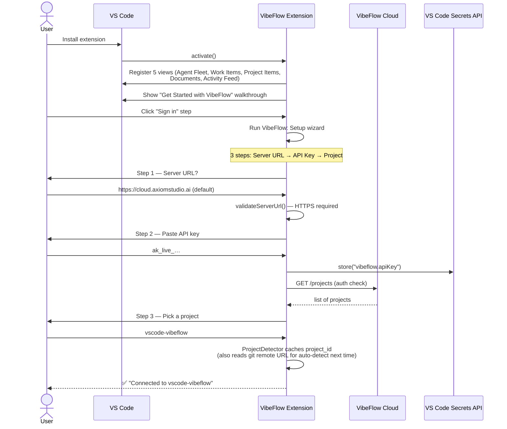
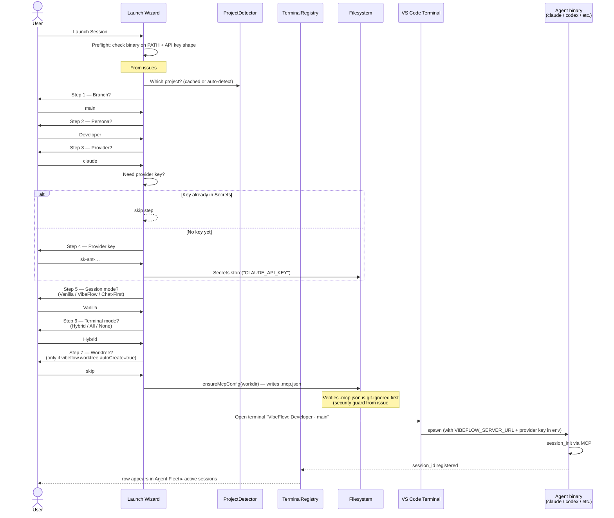
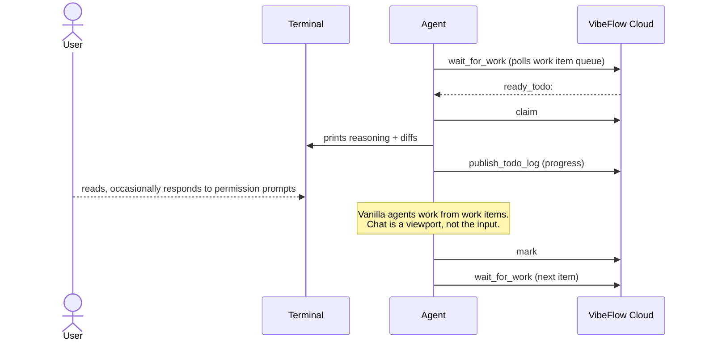
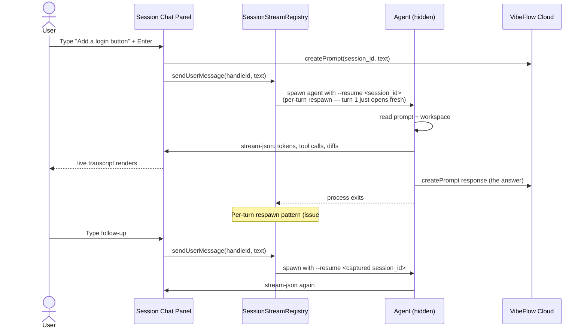
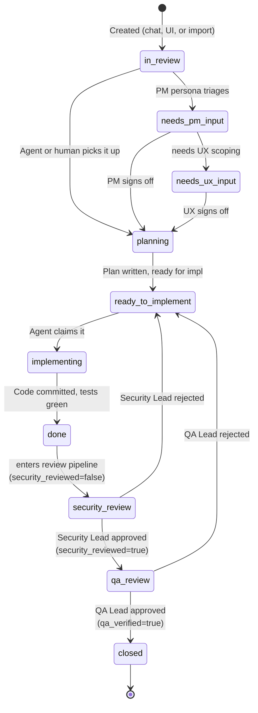
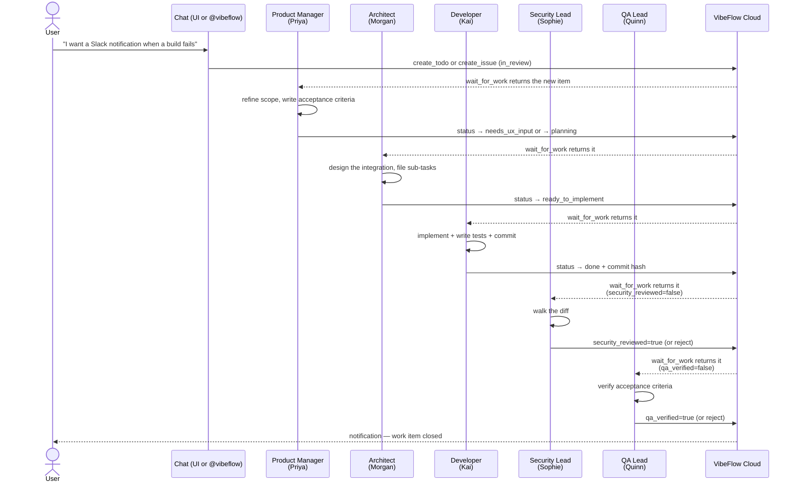
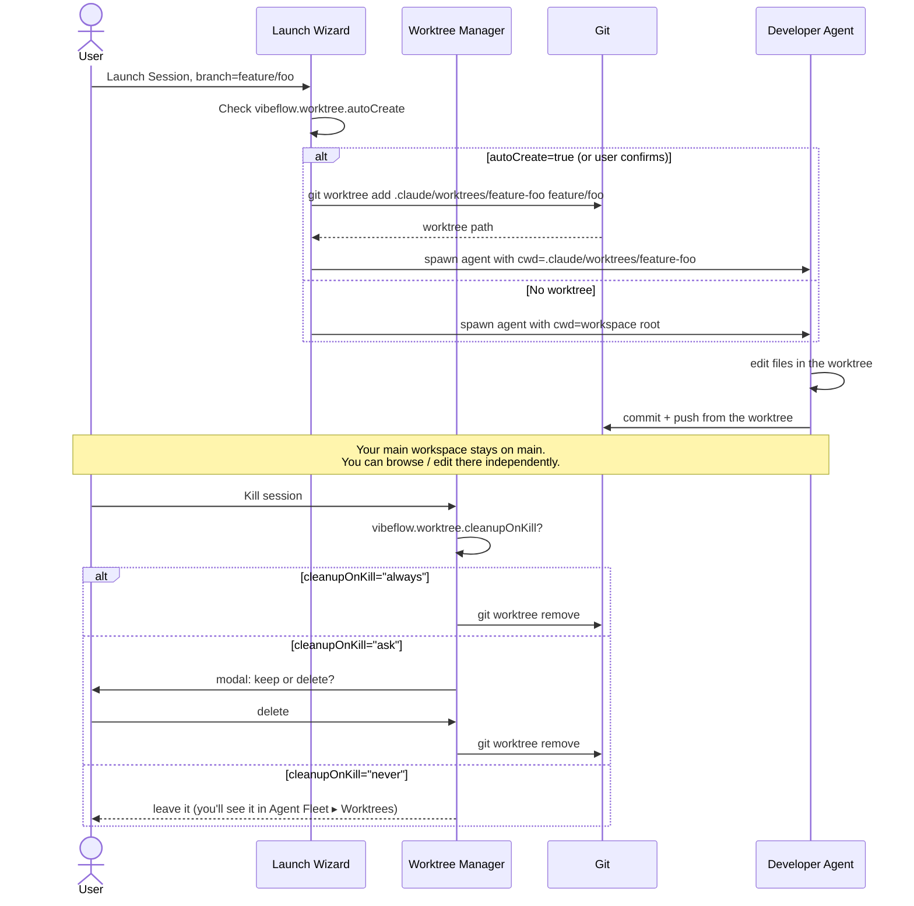

# Workflows and Flow Diagrams

**Who this is for**: Anyone who's installed the extension and wants to understand *how the pieces fit together* — what happens in what order, what calls what, what state moves where. This is the doc for "but **why** is it asking me that?"

**TL;DR**: Six end-to-end flows that cover ~95% of VibeFlow usage. Sequence + state diagrams in Mermaid (GitHub and VS Code render them natively).

> See [07-glossary.md](07-glossary.md) for any unfamiliar term.

---

## 1. New-user onboarding (first 5 minutes)

You install the extension. VS Code reloads. What happens next, in order:



**What you see**: walkthrough → "Sign in" link → three Quick Picks → "Connected" toast. About 90 seconds total.

**What can go wrong**: an invalid API key returns 401 from the server. The wizard surfaces the error and lets you re-paste. A non-HTTPS server URL is rejected by `validateServerUrl` (security guard from issue #1947). See [06-troubleshooting.md](06-troubleshooting.md) for symptoms + fixes.

---

## 2. Launch a session (the most common action)

You click **Launch Session** in the Agent Fleet view (or run `VibeFlow: Launch Session` from the Command Palette). Inside, the **Launch Wizard** asks you up to 7 questions before spawning the agent:



**The session-mode choice matters**:
- **Vanilla** — agent asks permission for every file edit, shell command, git op. Safe. Default.
- **VibeFlow (YOLO)** — agent skips permission prompts. Faster. You consent via a modal once per session.
- **Chat-First** — agent runs hidden, you interact through the Session Chat panel. YOLO is required (atomic bundle since issue #1611). Best for "talk to the agent like Copilot" workflows.

**What you see**: 5-7 Quick Pick / Input Box prompts, then a new terminal opens (in hybrid mode) or a chat panel opens (in chat-first mode), and a row appears in the Agent Fleet view.

---

## 3. Multi-turn chat — Vanilla session vs Chat-First session

The chat panel looks the same in both, but the plumbing is fundamentally different. Understanding why prevents confusion when chat hangs at "Working…" forever (see issue #2305).

### 3a. Vanilla session — terminal-driven

In vanilla mode, the agent's primary surface is the terminal. The Session Chat panel is *read-only-ish* — it streams the agent's output but the agent reads its instructions from the work items it pulls via `wait_for_work`, not from the chat panel.



**The Session Chat panel for vanilla sessions** shows a transcript but typing into the input box is **disabled** with an upfront banner ("This agent reads work items only — type your request and convert it into a tracked todo or issue"). The "Convert to work item" button opens the ad-hoc work-item Quick Pick.

### 3b. Chat-First session — chat-driven

In chat-first mode, the chat panel **is** the input. The agent runs hidden (under `tmux` if available, otherwise a hidden VS Code terminal), and you steer it by typing.



**The Session Chat panel for chat-first sessions** has an enabled input, a textarea, an @mention picker (`@symbol:`, `@document:`, `@todo:`, etc.), file-drop attachments, and renders agent diffs / commit hashes / file paths as clickable.

**Why two patterns**: vanilla = "agents work autonomously on tracked work items"; chat-first = "agent is like Copilot but with file-edit powers." Different use cases, different UI, intentional.

---

## 4. Work item lifecycle — from idea to closed

Every feature, todo, and issue moves through the same status machine. The shape:



**Where you (the human) typically step in**:
- **`in_review`** — you review what an agent or another user filed. Decide whether to promote.
- **`done` → `security_review`** — if you're acting as the Security Lead, you walk the diff and approve / reject.
- **`security_review` → `qa_review`** — if you're acting as QA Lead, you verify the AC.
- **Anywhere** — you can comment, change priority, change branch, change parent feature.

**Where agents step in**:
- `in_review → planning` (architect agents — claim items in `ready_to_implement` or `architecture_review_complete`)
- `planning → ready_to_implement` (after writing a plan)
- `ready_to_implement → implementing → done` (developer agents)
- `done → security_review → qa_review` (security/QA agents auto-poll for items needing their gate)

**The review gates exist on purpose**: silent regressions caught in production are the worst kind. Two recent incidents (commit `e0ef3ad` silently deleting #1947's three-layer HTTPS guard; commit `7a3d3be` silently deleting #1614's @mention picker) are exactly what the gates are meant to prevent in future.

---

## 5. Multi-persona handoff

A real workflow often touches multiple personas. Example: you ask for a new feature in chat. Here's what happens:



**Each persona is its own session** (one agent per persona on your machine, polling independently). They never talk to each other directly — coordination happens through the work item's status field and execution log on the server.

**You can collapse this**: not every team needs all 9 personas active. A minimal team is *Architect + Developer + QA* — three sessions, the rest implicit (you act as the PM and Security yourself).

---

## 6. Worktree workflow (multi-branch parallelism)

When you want a Developer agent working on `feature/foo` while you keep working on `main`, you have two options:

### Option A — switch branches yourself

Stash your changes, `git checkout feature/foo`, launch the Developer agent, watch it work. When you want to come back to `main`, kill the session, `git checkout main`, unstash. Friction-heavy.

### Option B — git worktree (the VibeFlow way)



**Why this matters**: you can have 3 Developer sessions running in parallel on 3 different branches, each in its own worktree, none of them stepping on each other or on your main checkout. The Agent Fleet view groups them under their respective branches.

**Cleanup gotcha**: the default `cleanupOnKill="ask"` modal does NOT surface dirty state (uncommitted changes). If you delete a worktree with uncommitted work, the work is gone. Recommended: leave `cleanupOnKill="ask"` and review the worktree's git status manually before clicking delete.

---

## Putting it all together — a realistic day

A representative day with VibeFlow active:

```mermaid
gantt
    title A morning with VibeFlow
    dateFormat HH:mm
    axisFormat %H:%M

    section You
    Open VS Code, walk Activity Feed :a1, 09:00, 5m
    Review overnight QA results       :a2, 09:05, 10m
    Type a new feature idea in chat   :a3, 09:15, 5m
    Click Convert to Work Item        :a4, 09:20, 1m
    Read PM-clarification prompt      :a5, 09:30, 5m
    Approve security review           :a6, 11:15, 10m

    section PM Agent (Priya)
    Refines scope                     :p1, 09:25, 15m
    Pings you for clarification       :p2, 09:40, 1m

    section Architect (Morgan)
    Plans architecture                :ar1, 09:50, 25m
    Files implementation todos        :ar2, 10:15, 5m

    section Developer (Kai)
    Implements first todo             :d1, 10:25, 35m
    Commits + pushes                  :d2, 11:00, 5m
    Marks done                        :d3, 11:05, 1m

    section Security (Sophie)
    Reviews diff                      :s1, 11:06, 8m
    Approves                          :s2, 11:14, 1m
```

You spend ~35 minutes of human attention; the agents do ~75 minutes of work in parallel. The Activity Feed is your single pane of glass — it shows every transition above.

---

## What this doc deliberately doesn't cover

- **Compliance findings** workflow — see the **Compliance** panel + [04-chat-first-mode.md](04-chat-first-mode.md) for the Security Lead persona's tools.
- **Pull request creation** — see `VibeFlow: Create Pull Request` and the branch-review status workflow. Single command; not a multi-step flow worth diagramming.
- **CLI handoff** (when `vibeflow.cli.enabled=true`) — relevant for ~5% of users; out of the common-flow scope. See [05-settings-reference.md](05-settings-reference.md).
- **Document comments + persona handoff** workflow — the comments feature is its own subsystem; see the Documents view's right-click menu.

---

*If a flow you care about isn't covered, open an issue at the VibeFlow repo with the question.*
